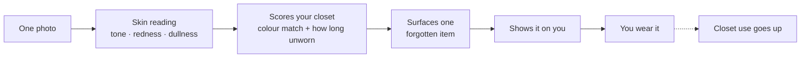

# ClosetIQ

**You already own something that works today. This helps you find it.**

Most people wear a small fraction of what they own — not because the rest is wrong, but because they forget it exists.

ClosetIQ reads your skin from a single photo, then picks something from your own wardrobe that suits you *today* and that you haven't touched in months. It shows you wearing it before you commit.



## Why skin analysis?

A colour that clashes on a day your skin is flushed can be the right choice a week later.

Most "dead" clothes aren't wrong — they're **wrong-for-the-day**. Reading your skin each time is what lets the app give each forgotten item its moment, instead of recommending the same five favourites forever.

## Built with

Three PerfectCorp YouCam APIs, working as one:

| API | Used for |
|---|---|
| **AI Skin Analysis** | today's redness, dullness, dark circles |
| **AI Facial Color Tones** | undertone and skin type → your palette |
| **AI Clothes Virtual Try-On** | showing the garment on you |

Both skin readings come from **the same photo** — you're never asked to take a second one.

## Running it

```bash
cd backend && npm install && npm start
```

Then open the project in Android Studio and run on an emulator.

The app talks only to the local backend, never to YouCam directly, so API credentials stay off the device.
